<div align="center">

<a href="https://playgarba.com/">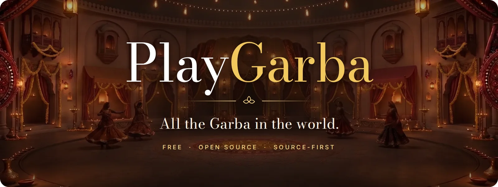</a>

<br>

<h3>A free, open-source home for Garba music, with a garba night you can walk into.</h3>

Albums, cassettes, nonstop sets, live Navratri nights and chapters of long recordings, catalogued from evidence and playable in one tap. Listen in a quiet palace courtyard, or step into a full garba ground with a band, a crowd, food stalls and the circle clapping around you.

<br>

<a href="https://playgarba.com/"></a>
&nbsp;
<a href="https://playgarba.com/explore/"></a>
&nbsp;
<a href="https://github.com/ruddvz/garba/issues/new/choose"></a>

<br><br>


<a href="LICENSE"></a>
<a href="docs/project/licensing.md"></a>
<a href="#best-way-to-listen"></a>
<a href="CONTRIBUTING.md"></a>

<br><br>

<b><a href="#two-ways-to-listen">Two ways to listen</a></b> &nbsp;·&nbsp;
<b><a href="#immersive-a-garba-night-you-can-walk-into">Immersive</a></b> &nbsp;·&nbsp;
<b><a href="#everything-else-it-does">Features</a></b> &nbsp;·&nbsp;
<b><a href="#best-way-to-listen">Best way to listen</a></b> &nbsp;·&nbsp;
<b><a href="#music-coverage">Catalogue</a></b> &nbsp;·&nbsp;
<b><a href="#contributing">Contribute</a></b> &nbsp;·&nbsp;
<b><a href="#licence-free-and-staying-free">Licence</a></b>

<br><br>

<a href="https://playgarba.com/">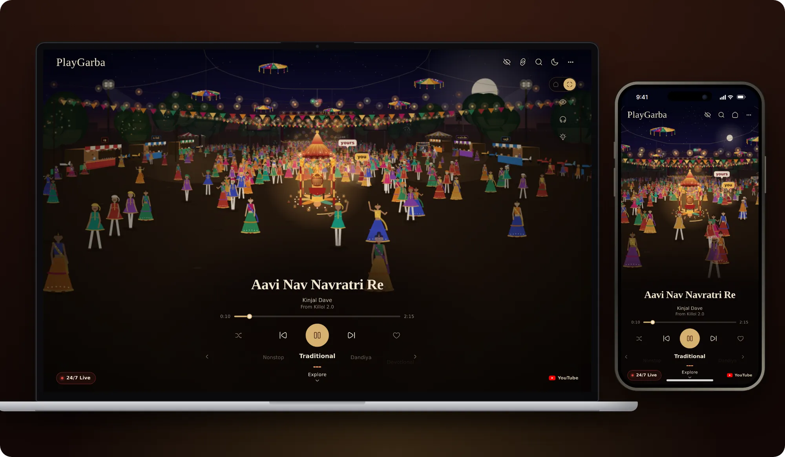</a>

</div>

<br>

<table align="center">
  <tr>
    <td align="center" width="96"><br><sub><b>Nonstop</b></sub></td>
    <td align="center" width="96"><br><sub><b>Traditional</b></sub></td>
    <td align="center" width="96"><br><sub><b>Dandiya</b></sub></td>
    <td align="center" width="96"><br><sub><b>Devotional</b></sub></td>
    <td align="center" width="96"><br><sub><b>Folk</b></sub></td>
    <td align="center" width="96"><br><sub><b>Sanedo</b></sub></td>
    <td align="center" width="96"><br><sub><b>Fusion</b></sub></td>
  </tr>
</table>

---

## Why this exists

Garba music is everywhere, and almost none of it is in one place. It is spread across old albums and cassettes, CDs, streaming releases, live Navratri performances, three-hour nonstop sets, community uploads, artist pages, labels and local archives. Titles are spelled five ways. Live sets have no track lists. Good recordings sit next to the wrong ones.

PlayGarba fixes that in two parts:

1. **A careful catalogue.** Every song, release and live set is recorded from evidence. Missing dates, credits and durations stay blank until a source fills them.
2. **A listening app worth opening.** Fast, installable and good-looking on a phone in the middle of a garba ground, with no account and no paywall.

It is free, it has no ads of its own, and it is open source so it can stay that way.

## Two ways to listen

<p align="center">
  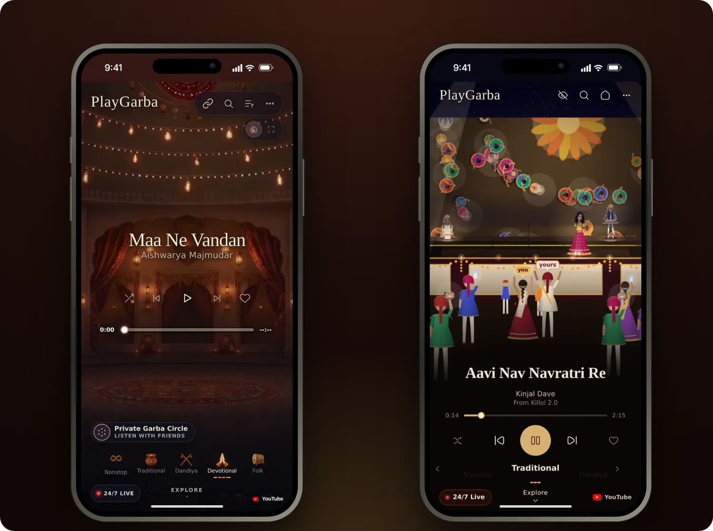
</p>

| | **Simple** | **Immersive** |
| --- | --- | --- |
| **What you see** | A lantern-lit palace courtyard, painted for each genre | A whole garba night: venue, crowd, band, stalls and sky |
| **Best for** | Quick listening and lighter devices | Headphones, a big screen, a Navratri evening at home |
| **Controls** | Play, genres, Explore, Up next, Circle, Live | All of those, plus View, Sound and Ideas |
| **Switching** | Tap Immersive on the switch under More | Tap the home half to go back to Simple; the other half goes full screen |

Both views drive the same player, so the song, queue, Circle and Live carry on when you switch, and your choice is remembered on the device. If Immersive can't load on a device, Simple is always there.

## Immersive: a garba night you can walk into

Immersive puts you on a garba ground at night. There is a lit garbo at the centre with rings of dancers around it, a stage with a live band, food stalls round the edges and strings of lights overhead. You and your partner are in the crowd, with name tags over your heads. Everything moves with the song. The circles form when the music starts, the crowd lifts its phones, and people drift off to the stalls and chairs when it stops.

### Three venues

<table>
  <tr>
    <td width="33%" valign="top">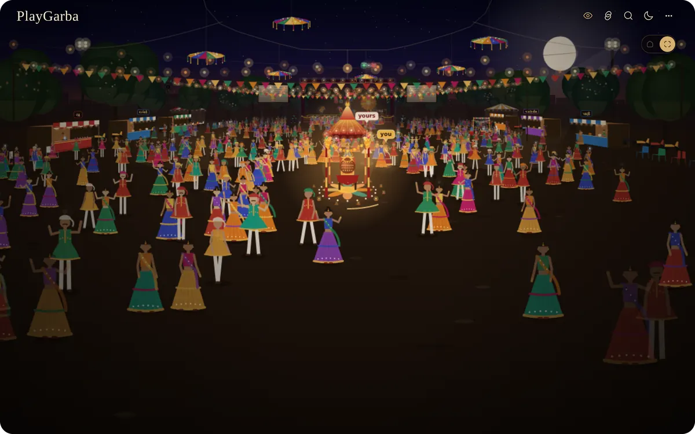<br><b>Outdoors</b><br><sub>An open garba ground with floodlight towers, neem and peepal trees in fairy lights, rows of plastic chairs and parked scooters at the edges. Almost no reverb, just echoes off the speaker stacks and far buildings.</sub></td>
    <td width="33%" valign="top">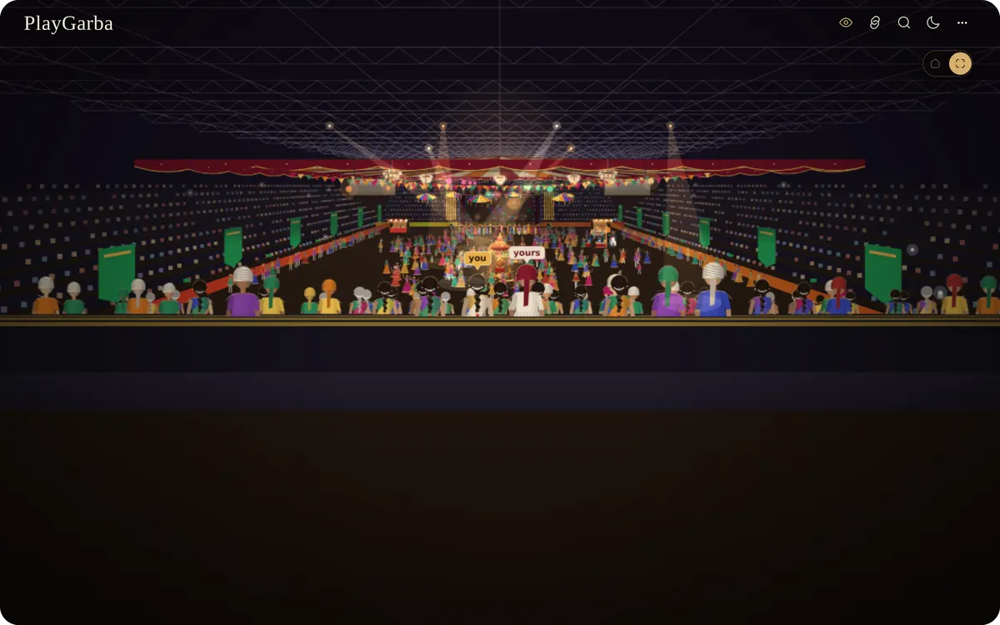<br><b>Indoor stadium</b><br><sub>A big covered arena under a shamiana, with jhummar chandeliers, stepped stands and corner screens. A long, dense reverb and a slap back off the far stands.</sub></td>
    <td width="33%" valign="top">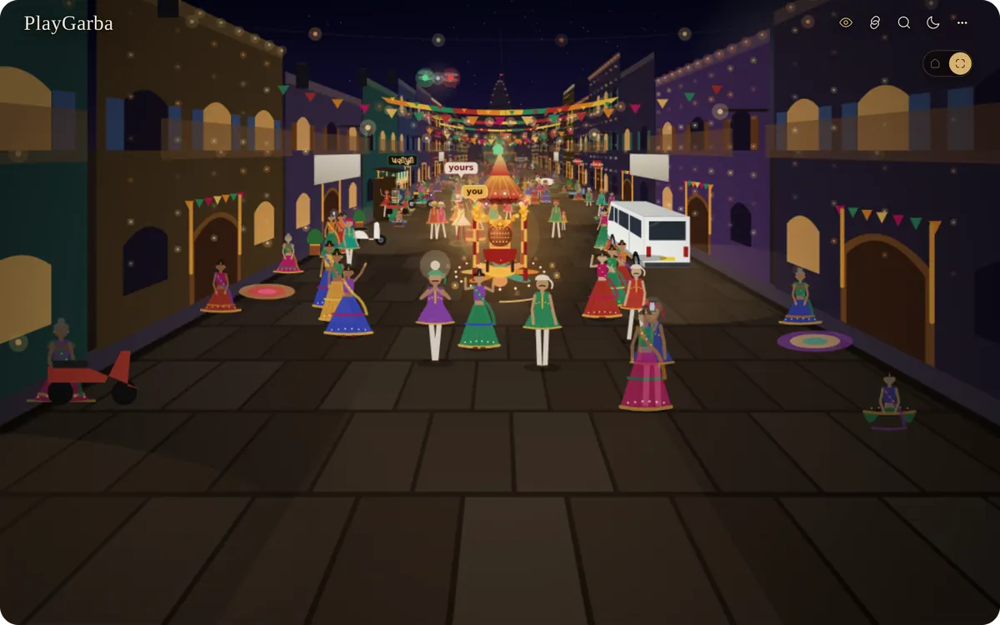<br><b>Sheri</b><br><sub>A society's garba in the lane between the houses, with a temple spire outlined in bulbs, a van and Activas parked along the edge, and neighbours on the otla. Bright flutter off the walls, a short tail.</sub></td>
  </tr>
</table>

### Where you stand

The view and the sound both change with where you stand.

<table>
  <tr>
    <td width="33%" valign="top">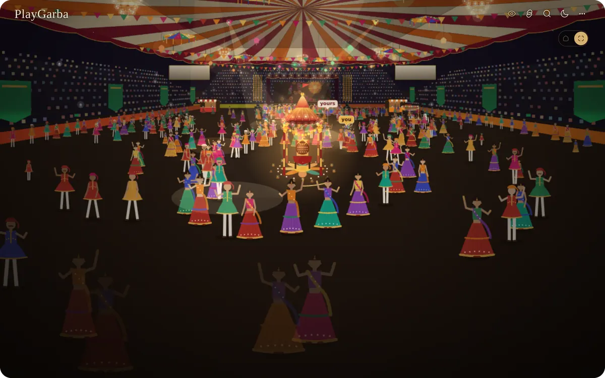<br><b>In the circle</b><br><sub>You are dancing, with clappers all around you.</sub></td>
    <td width="33%" valign="top">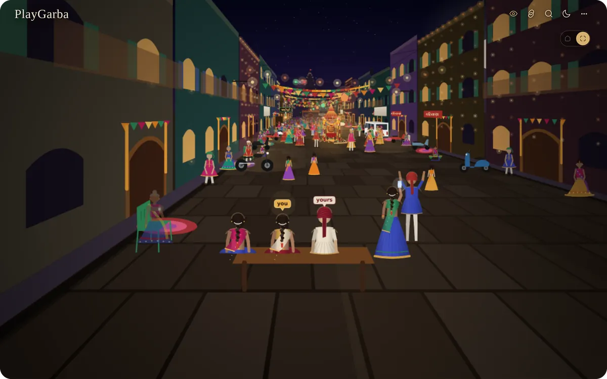<br><b>Far away</b><br><sub>You watch from a bench or the chairs at the edge. The circle sounds distant, softer and more echoey.</sub></td>
    <td width="33%" valign="top">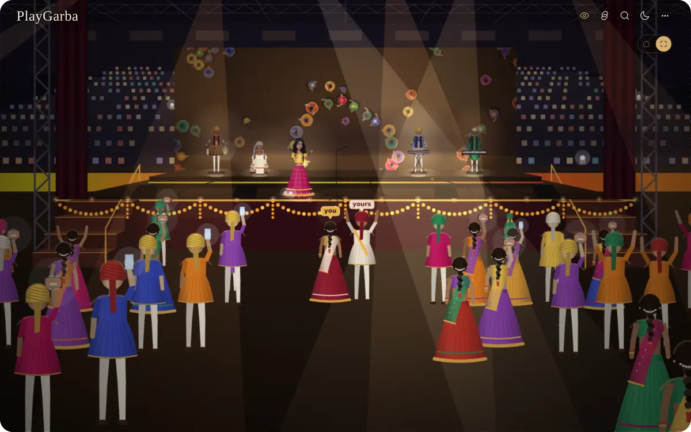<br><b>By the stage</b><br><sub>You are up front by the band, with the crowd around you and the circle clapping behind.</sub></td>
  </tr>
</table>

### The stage and the band

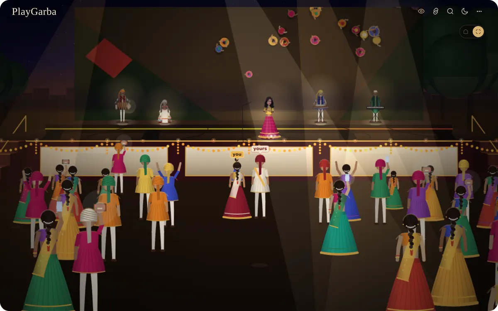

- **The song's own singers** walk on for each song, one, two or three of them, dressed for who they are and wearing the artist's portrait when there is one. Between songs they walk off and the next singers walk on.
- **The band** has a dhol, keys, benjo and tabla. Each player has flourishes of their own: sticks thrown up, a hand in the air, a fast run. Now and then they all hit it together.
- **The stage** has a truss with moving heads, line arrays, wedge monitors, haze, and marigold garlands along the front edge.
- **The big screen** carries a drone's-eye view of the ground circling over the garbo. It cuts to ground-level close-ups of the lead singer, a dancer, a child running through, and the two of you.

<br clear="right">

### Walk the ground

Hide the player and the whole screen is the venue. Walk with the **arrow keys**, or on a phone **drag anywhere**. The view looks ahead as you go and swings round to face a stall you walk up to. **Escape** takes you back to your place in the circle.

- **Food stalls** show their wares up close, and the seller calls out as you arrive:
  *Cutting chai?* · *Garam dabeli!* · *Pani puri, teekha?* · *Thandu paani!* · *Kulfi, kesar pista!* · *Fafda jalebi!*
- **Life around the dancing:** couples stop to dance as a pair when the music plays, children play tag in front of the stage, older folk watch from the chairs, and a few sit out with a cup of tea.
- **The sky** shows tonight's real moon phase.
- **It fits the device.** Phones and tablets start with a lighter scene and step down on their own when frames run slow, so the scene stays smooth.

### The DJ's booth

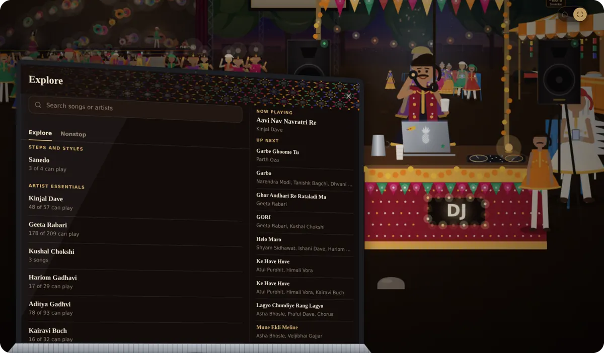

Open **Explore** and you walk over to the DJ's table. The song list opens as his laptop, turned towards you, while he sips chhas from a paper cup.

He looks up and asks **શું જોઈએ?** (*What would you like?*). Pick a song and he says **થઈ જશે!** (*It'll be done!*), then you walk back as it starts. Ask for one next and he tells you **આના પછી આ જ!** (*This one next!*).

Explore in Immersive opens on lists: **Steps and styles**, then **Artist essentials**. A list keeps Next, auto-play and shuffle inside it until you leave it.

<br clear="left">

### You and your partner

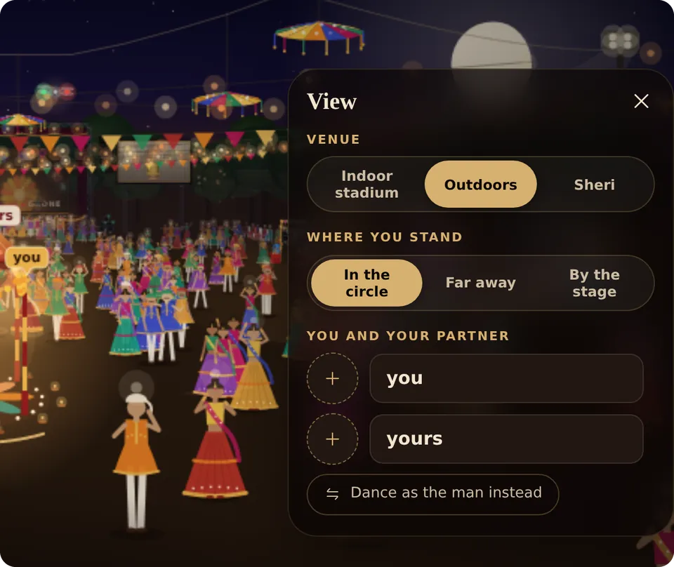

- **Your names** float over your heads as tags. Change them in **View**.
- **Your faces:** add a photo for yourself and your partner, crop it in the circle, and your dancers wear it in every view, even seen from behind.
- **Dance as the man instead** swaps who you are in the pair.
- **Up close** the dancers have shaped eyes, brows and lips, clothes with embroidery bands and mirror work, a gajra and paranda in the braid, and a pagdi wound in layers.

Photos stay on your device. Nothing is uploaded.

<br clear="right">

### Sound

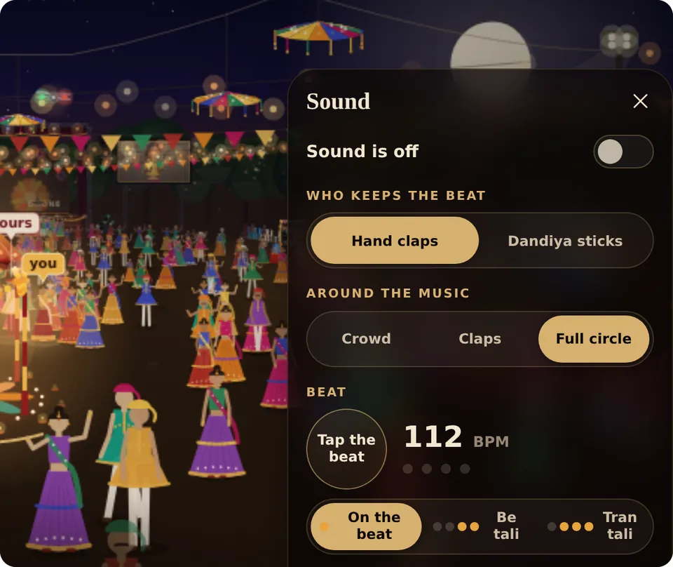

Turn on **Sound** and the circle is around the song, not on top of it.

- **Around the music:** *Crowd* (people, chatter and the night air), *Claps* (the circle clapping in time), or *Full circle* (the crowd and the claps all around you; best on headphones).
- **Who keeps the beat:** hand claps or dandiya sticks.
- **Tap the beat** to set the tempo, then choose where the claps land: *On the beat*, *Be tali* or *Tran tali*.
- **Every venue is its own room.** The song's dhol booms under the stadium roof, comes back off the speaker stacks outdoors, and flutters between the house walls in the sheri.
- **Where you stand is heard too.** Far away, the circle loses its highs, the room takes over and the far side arrives later.

<br clear="left">

### And more in Immersive

- **Lighting follows the genre:** warm marigold and oil-lamp light for Traditional, bright sweeping colour and sticks in every hand for Dandiya, soft saffron and white for Devotional, neon washes for Fusion.
- **Tonight** plays a Garba night in five parts, one after another.
- **Share this song** makes a portrait share card.
- **What is Garba?** is a short guide with a Mata ni Pachedi border.
- **Ideas** lets anyone ask for a feature. Their words are kept exactly as written.
- **Full screen** and **Hide player** give the whole screen to the venue.

<p align="center">
  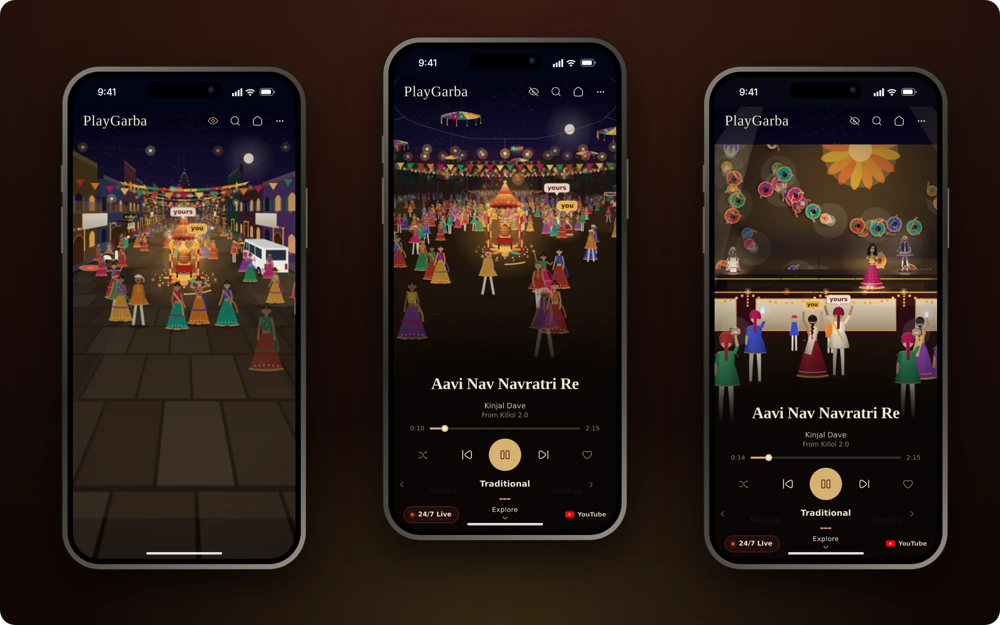
</p>

## Everything else it does

<table>
  <tr>
    <td valign="top" width="50%">

**Play by world.** Tap Traditional, Dandiya, Devotional, Folk, Sanedo or Fusion and a song starts straight away.

**Nonstop Garba.** Long sets and nonstop albums are first-class, with chapters where the source publishes them.

**24/7 Live.** Garba radio that is always on. Everyone tuned in hears the same song.

**Private Garba Circle.** Share a link or QR code and a whole group hears the same song at the same moment, each on their own phone. No server, no sign-up.

</td>
    <td valign="top" width="50%">

**Explore.** Browse by genre, artist and release, search, and see which songs are playable first. Songs that can't play say so and never start.

**Your own songs.** Keep favourites, build Up next, and paste in YouTube links of your own.

**Keyboard and lock screen.** J and L skip 10 seconds on a laptop, and lock-screen and headset controls work where the phone offers them.

**Install it.** Add it to your home screen like an app. See [Best way to listen](#best-way-to-listen).

</td>
  </tr>
</table>

<p align="center">
  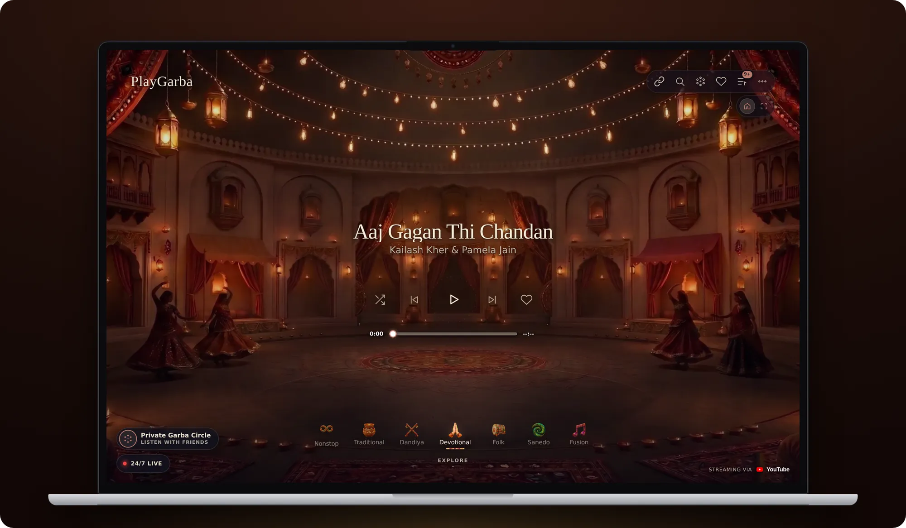
</p>

## Best way to listen

<a href="https://brave.com/download/"></a>

**On a phone or iPad, listen in [Brave](https://brave.com/download/).** Most phone browsers stop YouTube when you switch apps or the screen locks. A web page can't keep it going, and PlayGarba won't work around YouTube's rules to force it. Brave has its own background playback for web video, so the music carries on.

| Device | Listen in | Add PlayGarba to your home screen |
| --- | --- | --- |
| **iPhone** | Brave. It's the browser we suggest on iPhone. | Brave can't add it to the Home Screen. Open playgarba.com in **Safari**, tap **Share**, then **Add to Home Screen**. It opens full screen, without the browser bars. |
| **iPad** | Brave | In Safari: **Share**, then **Add to Home Screen**. |
| **Android** | Brave. The music keeps playing when your screen turns off or you switch to another app. | In Brave: open the menu and tap **Install app**, or **Add to Home screen**. |
| **Computer** | Any browser | In Brave, Chrome or Edge: click the install icon at the right end of the address bar. |

The same steps are in the player under **More → Install PlayGarba**.

## Music coverage

The player presents six visual worlds:

| Player world | Music represented |
| --- | --- |
|  **Traditional** | Traditional Garba, roots/archive material, Tran Taali, Be Taali and related forms |
|  **Dandiya** | Raas, Dandiya and related dance traditions |
|  **Devotional** | Mataji, Krishna Garba, devotional Raas and temple-oriented material |
|  **Folk** | Gujarati folk, lokgeet, Hinch, Dakla and related traditions |
|  **Sanedo** | Sanedo and high-energy community/festival material |
|  **Fusion** | Modern Gujarati Garba, electronic, hip-hop, remix, cinematic and crossover material |

These are presentation worlds. The canonical taxonomy is more detailed and lives in `data/taxonomy.json`.

The catalogue holds more than 1,700 songs across more than 240 releases and keeps growing. For the exact deployed revision and current counts, use [`/build-info.json`](https://playgarba.com/build-info.json). For definitions, source layout and dated history, see [`docs/catalogue/status.md`](docs/catalogue/status.md).

## Principles

- **Source first.** Unknown dates, durations, credits and rights stay unknown until evidence supports them. A blank field is more useful than confident-looking fiction.
- **No piracy.** Commercial audio is never copied into this repository just because it is available elsewhere.
- **Evidence is not canon.** A Reddit tip, playlist or community upload can be useful evidence without automatically becoming release metadata.
- **Long-form Garba matters.** Live performances, nonstop albums and timestamped chapters are discovery objects in their own right, not edge cases.
- **The live site matches the source.** The player, generated catalogue, service worker and deployed build identity are validated so production cannot silently drift.

## Playback and rights

PlayGarba is a discovery and listening project, not an audio mirror.

Executable music playback is YouTube-only:

- exact verified YouTube recordings and directly verified timestamped chapters play through the visible YouTube IFrame player;
- Apple Music, Spotify, Amazon Music, SoundCloud, Bandcamp, Qobuz and direct-audio records may remain as source/provenance evidence, but they do not become executable fallbacks;
- unchaptered multi-song YouTube releases, provider reference pages and ambiguous same-title recordings stay non-executable until the exact recording is verified;
- PlayGarba does not extract raw streams, hide the YouTube player, suppress YouTube advertising or cache YouTube media for offline playback.

Artists and labels get the view, the credit and the ad revenue. The playback contract is in [`docs/product/youtube-first-playback.md`](docs/product/youtube-first-playback.md). Rights and provenance policy is in [`docs/catalogue/rights.md`](docs/catalogue/rights.md).

## How it fits together

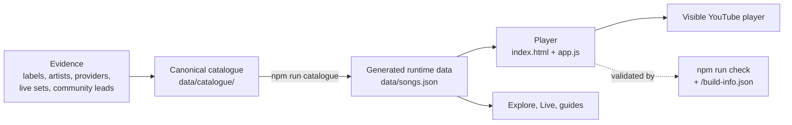

<details>
<summary><b>Repository layout</b></summary>

```text
garba/
├── index.html                  # production player entry point
├── app.js                      # production app/controller source
├── simple-runtime.js           # launch-safe runtime layer
├── provider-runtime.js         # YouTube-only execution policy
├── player-continuity.js        # selection/route continuity safeguards
├── youtube-player-runtime.js   # visible YouTube IFrame controller
├── nonstop-browser.js          # production Nonstop Garba browser
├── sw.js                       # production service worker
│
├── styles/                     # ordered, purpose-named CSS source layers
├── src/
│   └── optional/               # retained browser experiments, not shipped by Pages
├── assets/
│   ├── backgrounds/            # production artwork packs and world assets
│   └── icons/                  # app/PWA icons
├── data/
│   ├── catalogue/              # canonical source shards and manifest
│   ├── discovery/              # artists, recommendations and live/nonstop sets
│   ├── rights-acquisition/     # rights operations data
│   └── README.md               # source vs generated-data contract
├── docs/
│   ├── catalogue/              # schema, status, sources and catalogue rights
│   ├── product/                # design, playback, responsive/PWA and UX notes
│   ├── rights/                 # partnership and licensing operations
│   ├── operations/             # hosting, ingestion and publishing procedures
│   ├── project/                # roadmap and licensing
│   └── README.md               # canonical documentation index
├── scripts/                    # catalogue, validation and operations tooling
└── .github/                    # issues and CI/Pages workflows
```

The root is intentionally small. A browser file lives there only if it is part of the production runtime or a standard repository entry point.

GitHub Pages builds one production artifact at `playgarba.com`. Production `app.js` and `styles.css` are assembled from several source layers, so source-file byte differences alone are not proof that production is stale. The deployed `/build-info.json` records the exact Git revision and SHA-256 digests for key assembled files.

</details>

<details>
<summary><b>Catalogue layout</b></summary>

Canonical catalogue shards are listed explicitly in `data/catalogue/index.json`. That manifest controls what the build consumes.

```text
data/catalogue/
├── index.json
├── songs/
├── releases/
├── free-sources/
└── archive/                    # retained but deliberately unindexed fragments
```

Existing numbered shards are append-only. Renumbering old shards to make the sequence look tidy would create noisy history and contributor conflicts. New semantic shards take the next sequence number and a descriptive suffix.

Generated aggregate files are rebuilt through the project scripts, never edited as competing sources of truth.

</details>

## Run it locally

```bash
git clone https://github.com/ruddvz/garba.git
cd garba
npm run check
npm run serve
```

Then open `http://localhost:4173`. No install step and no framework: it is plain HTML, CSS and JavaScript with Node scripts for the catalogue build.

`npm run check` rebuilds the catalogue and validates runtime/data contracts, YouTube route truth, repository structure, documentation and the build-identity contract. PWA installation needs HTTPS or a browser-recognised local origin.

## Contributing

You do not need to write code to help. The most useful contributions are often:

- a missing song, album, live set or nonstop programme;
- an old track list, or timestamps for a long recording;
- a regional artist who is not in the catalogue yet;
- a spelling, transliteration or classification correction;
- an official source that confirms or corrects a record;
- a player bug, accessibility fix or performance improvement.

Start with [`CONTRIBUTING.md`](CONTRIBUTING.md), or [open an issue](https://github.com/ruddvz/garba/issues/new/choose) with what you know and where you found it. https://tally.so/r/0QXgY9

The one hard rule: **do not guess catalogue facts, and do not upload music you do not have the right to redistribute.**

## Licence: free, and staying free

PlayGarba was made to be free for everyone. The licence is not there to make anything harder. It is there so the work stays open and nobody can close it off or pass it off as their own.

| Part | Licence |
| --- | --- |
| Code | [GNU AGPL-3.0-only](LICENSE) |
| Catalogue data, docs, editorial text | [CC BY-SA 4.0](https://creativecommons.org/licenses/by-sa/4.0/) |
| PlayGarba name, wordmark, icons, Garbo mark | Reserved, see [`TRADEMARKS.md`](TRADEMARKS.md) |
| Music, recordings, album art, YouTube videos | Owned by their rights holders |

**You can** use it, study it, fork it, change it, host it and build on the data, at no cost and without asking.

**If you share or host a changed version**, keep it open under the same licence, keep the credit in [`NOTICE`](NOTICE) (`Based on PlayGarba`, with a link here), say that it is changed, and give it your own name.

Plain-language details, including what this means for contributors, are in [`docs/project/licensing.md`](docs/project/licensing.md). To cite PlayGarba in research or writing, use [`CITATION.cff`](CITATION.cff) or the "Cite this repository" button on GitHub.

---

<div align="center">

PlayGarba is still growing. If something is missing, keep the gap visible, find the evidence and add it carefully.

**[playgarba.com](https://playgarba.com/)**

</div>
